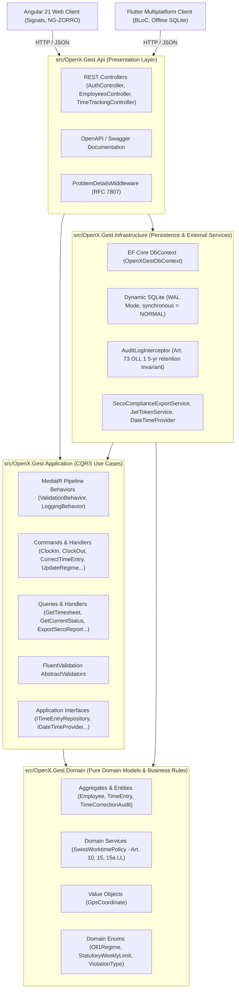
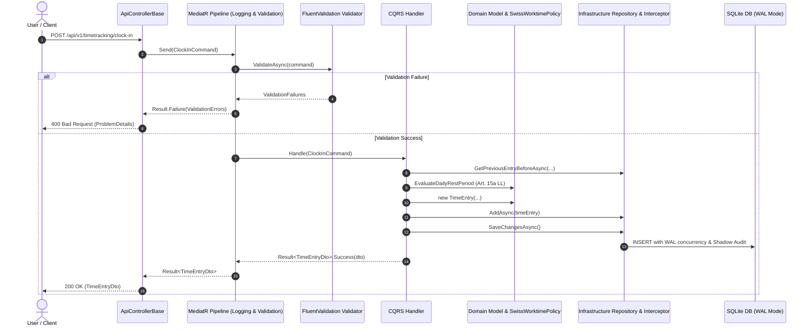

# Open-X-Gest - Enterprise Management & Multiplatform System

[](https://dotnet.microsoft.com/)
[](https://angular.dev/)
[](https://flutter.dev/)
[]()
[]()

**Open-X-Gest** is an enterprise-grade workforce management, attendance tracking, and compliance ecosystem designed for maximum reliability, portable deployment, and strict regulatory adherence under **Swiss Labor Law (LAL / OLL 1, ArGV 1, Art. 73 OLL 1)**.

The solution combines a high-performance **.NET 11 Clean Architecture & CQRS** backend, a reactive **Angular 21 Standalone & Signals** web client, and an **offline-first Flutter multiplatform** client.

---

## 🏛️ Full-Stack System Architecture



---

## 🔄 CQRS Execution Flow

Every command and query follows a unidirectional CQRS pipeline intercepted by pipeline behaviors for automatic validation and performance telemetry:



---

## 🇨🇭 Swiss Labor Law Invariants & Compliance Rules

The domain layer strictly encapsulates the requirements of the Swiss Federal Act on Work in Industry, Crafts and Commerce (Labor Act, EmpA / LL) and Ordinance 1 (OLL 1):

1. **Mandatory Daily Rest (Art. 15a LL / Art. 19 OLL 1)**:
   - Mandatory minimum of **11 consecutive hours** of rest between consecutive shifts.
   - Rest periods under 11 hours automatically trigger a `DailyRestPeriodViolated` flag.

2. **Maximum Daily Amplitude (Art. 10 LL / Art. 13 OLL 1)**:
   - Daily work inclusive of breaks must fall within a maximum amplitude of **14 hours**.
   - Spans exceeding 14 hours automatically trigger a `DailyAmplitudeExceeded` flag.

3. **Statutory Rest Breaks (Art. 15 LL)**:
   - Workday > 5.5 hours: minimum **15 minutes** of break.
   - Workday > 7.0 hours: minimum **30 minutes** of break.
   - Workday > 9.0 hours: minimum **60 minutes** of break.

4. **Statutory Retention & Hard Delete Block (Art. 73 cpv. 2 OLL 1)**:
   - All punch records, timesheets, and retroactive audit records must be preserved for at least **5 years**.
   - Physical hard deletes on `TimeEntry` and `TimeCorrectionAudit` are forbidden and blocked in `AuditLogInterceptor` throwing an `InvalidOperationException`.

5. **Punctual Geolocation (Art. 26 OLL 3 & nLPD)**:
   - Geolocation is acquired strictly as an instantaneous, punctual coordinate at the moment of clocking in or out.
   - Continuous background tracking is strictly prohibited.

---

## 📁 Repository Anatomy

```text
Open-X-Gest/
├── Open-X-Gest.slnx                # Visual Studio XML Solution orchestrating backend projects
├── Directory.Build.props           # Global MSBuild rules, Roslynator, StyleCop, SonarAnalyzer
├── .editorconfig                   # Centralized Roslyn and code styling rules
├── nuget.config                    # Package restore & source mappings
├── sonar-project.properties        # SonarQube quality gate configuration
├── aspire.config.json              # Aspire configuration
│
├── dockers/
│   └── seq/
│       └── docker-compose.yml      # Local Seq structured logging container
│
├── src/
│   ├── OpenX.Gest.Domain/          # Pure domain models, entities, business logic & invariants
│   ├── OpenX.Gest.Application/     # CQRS use cases (MediatR), FluentValidation, DTOs & interfaces
│   ├── OpenX.Gest.Infrastructure/  # EF Core, dynamic SQLite (WAL mode), DbInitializer & identity
│   └── OpenX.Gest.Api/             # ASP.NET Core Web API presentation layer
│
├── frontend/                       # Angular 21 Enterprise Web Client
│   ├── src/                        # Standalone components, signals, services & NG-ZORRO UI
│   ├── package.json                # NPM scripts and dependencies
│   ├── AGENTS.md                   # Specialized Frontend Agent Guidelines
│   ├── ARCHITECTURE.md             # Frontend Architectural Deep-Dive
│   └── TESTING.md                  # Vitest Unit Testing Standards
│
├── mobile/                         # Flutter Multiplatform Client (Android, iOS, Desktop, Web)
│   ├── pubspec.yaml                # Flutter dependencies
│   ├── AGENTS.md                   # Specialized Mobile Agent Guidelines
│   ├── ARCHITECTURE.md             # Mobile Offline-First Documentation
│   └── TESTING.md                  # Flutter & BLoC Testing Standards
│
└── tests/
    └── OpenX.Gest.Application.UnitTests/ # Complete test suite for Domain, CQRS, Behaviors, and Controllers
```

---

## 🔑 Default Seed Data & Test Users

On initial startup, `DbInitializer` provisions sample users corresponding to different Swiss labor regimes:

| Employee | Email | Statutory Limit | Regime | Canton / Language |
| :--- | :--- | :--- | :--- | :--- |
| **Marco Rossi** | `marco.rossi@openx.ch` | 45 Hours / Week | Standard Record (Art. 73 OLL 1) | Ticino (Italian) |
| **Thomas Müller** | `thomas.mueller@openx.ch` | 45 Hours / Week | Simplified Record (Art. 73a OLL 1) | Zurich (German) |
| **Jean-Luc Dubois** | `jeanluc.dubois@openx.ch` | 45 Hours / Week | Opt-Out (Art. 73b OLL 1) | Geneva (French) |
| **Sarah Jenkins** | `sarah.jenkins@openx.ch` | 45 Hours / Week | Standard Record (Art. 73 OLL 1) | Basel (English) |

---

## 🧪 Testing & Verification Protocols

### Backend Test Suite & Coverage

The solution contains a test suite covering Domain Entities, Value Objects, Domain Policies, MediatR Commands/Queries/Validators, Pipeline Behaviors, Infrastructure Interceptors, and Controllers:

```bash
# Compile solution with zero warnings under TreatWarningsAsErrors
dotnet build Open-X-Gest.slnx

# Run all backend unit tests
dotnet test Open-X-Gest.slnx

# Collect cross-platform code coverage
dotnet test Open-X-Gest.slnx --collect:"XPlat Code Coverage"
```

### Frontend Test Suite (Angular 21 + Vitest)

```bash
cd frontend

# Install packages
npm install

# Run single-run Vitest test suite
npm test -- --watch=false

# Build production bundle
npm run build
```

### Mobile Test Suite (Flutter)

```bash
cd mobile

# Static analysis
flutter analyze

# Run unit and BLoC tests
flutter test
```

---

## 🛡️ Code Quality & Quality Gates

All code in this repository enforces:
- **Zero Warnings**: Global `TreatWarningsAsErrors=true` enforced with Roslynator, StyleCop (`SA*`), and SonarAnalyzer (`S*`).
- **Clean Architecture Principles**: Strict inward dependency flow with explicit interface boundaries.
- **Single Responsibility (SRP)**: Each command, query, validator, handler, and DTO resides in its own dedicated, isolated file.
- **English Language**: Mandatory for all identifiers, comments, logs, and documentation.
